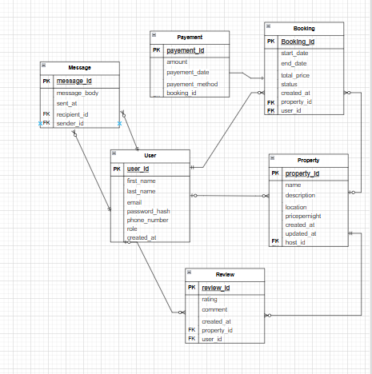

### Entities and Attributes

#### 1. User
- **user_id**: Primary Key, UUID, Indexed
- **first_name**: `VARCHAR`, NOT NULL
- **last_name**: `VARCHAR`, NOT NULL
- **email**: `VARCHAR`, UNIQUE, NOT NULL
- **password_hash**: `VARCHAR`, NOT NULL
- **phone_number**: `VARCHAR`, NULL
- **role**: `ENUM` (guest, host, admin), NOT NULL
- **created_at**: `TIMESTAMP`, DEFAULT `CURRENT_TIMESTAMP`

#### 2. Property
- **property_id**: Primary Key, UUID, Indexed
- **host_id**: Foreign Key, references `User(user_id)`
- **name**: `VARCHAR`, NOT NULL
- **description**: `TEXT`, NOT NULL
- **location**: `VARCHAR`, NOT NULL
- **pricepernight**: `DECIMAL`, NOT NULL
- **created_at**: `TIMESTAMP`, DEFAULT `CURRENT_TIMESTAMP`
- **updated_at**: `TIMESTAMP`, ON UPDATE `CURRENT_TIMESTAMP`

#### 3. Booking
- **booking_id**: Primary Key, UUID, Indexed
- **property_id**: Foreign Key, references `Property(property_id)`
- **user_id**: Foreign Key, references `User(user_id)`
- **start_date**: `DATE`, NOT NULL
- **end_date**: `DATE`, NOT NULL
- **total_price**: `DECIMAL`, NOT NULL
- **status**: `ENUM` (pending, confirmed, canceled), NOT NULL
- **created_at**: `TIMESTAMP`, DEFAULT `CURRENT_TIMESTAMP`

#### 4. Payment
- **payment_id**: Primary Key, UUID, Indexed
- **booking_id**: Foreign Key, references `Booking(booking_id)`
- **amount**: `DECIMAL`, NOT NULL
- **payment_date**: `TIMESTAMP`, DEFAULT `CURRENT_TIMESTAMP`
- **payment_method**: `ENUM` (credit_card, paypal, stripe), NOT NULL

#### 5. Review
- **review_id**: Primary Key, UUID, Indexed
- **property_id**: Foreign Key, references `Property(property_id)`
- **user_id**: Foreign Key, references `User(user_id)`
- **rating**: `INTEGER`, CHECK: `rating >= 1 AND rating <= 5`, NOT NULL
- **comment**: `TEXT`, NOT NULL
- **created_at**: `TIMESTAMP`, DEFAULT `CURRENT_TIMESTAMP`

#### 6. Message
- **message_id**: Primary Key, UUID, Indexed
- **sender_id**: Foreign Key, references `User(user_id)`
- **recipient_id**: Foreign Key, references `User(user_id)`
- **message_body**: `TEXT`, NOT NULL
- **sent_at**: `TIMESTAMP`, DEFAULT `CURRENT_TIMESTAMP`

### relationships between entities
- A user can have many properties (one-to-many).
- A property belongs to one user (many-to-one).
- A property can have many bookings (one-to-many).
- A booking belongs to one property (many-to-one) and one user (many-to-one).
- A booking can have one payments (one-to-one).
- A payment belongs to one booking (one-to-one).
- A user can have many reviews (one-to-many).
- A review belongs to one user (many-to-one) and one property (many-to-one).
- A property can have many reviews (one-to-many).
- A user can have many messages (one-to-many).
- A message belongs to one sender (many-to-one) and one recipient (many-to-one).

### Diagram 

